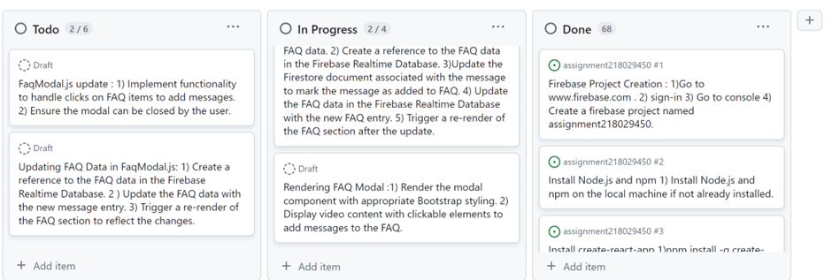
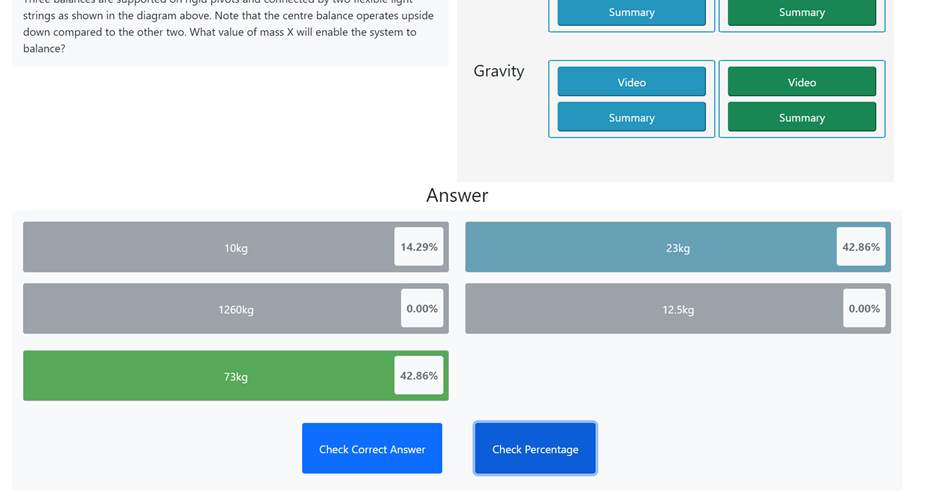

# Assignment 3 for Web Application Development 1
## Introduction 
The web application development project is a React web application hosted on firebase, featuring live chat support, FAQ section with fixes and hinting using overall response percentages. The live chat feature supports users to get quick answers to their queries and issues from the admin. The question help feature now includes an overall percentage,indicating the popularity of each answer option based on user responses, enhancing decision-making with collective feedback. The app has fully functional authentication login process which gives access to Question page. As users navigate through the hints section, any associated FAQs are seamlessly integrated, providing additional context and answers alongside the relevant videos for problem-solving and user support.The data are stored in firebase. The component model of the React app ensures that different parts of the website work together smoothly.
  
Figure 1: High Level Architectural Diagram for Web Application

## Installation instructions 
 **Install Dependencies**:
## Prerequisites

Before getting started, Git must be installed. It can be downloaded and installed from [here](https://git-scm.com/).

## Getting Started

1. **Clone the Repository**   

     git clone https://github.com/18029450uhi/assignment218029450.git

2. **Install Dependencies**   

 - cd /repository
 - npm install
 - Install Node.js if already not installed.
3. **Start the Development Server**   

     In the terminal run  npm start.

4. **Open the Application**    

     Visit `http://localhost:3000` in the web browser.

### Methodology  

#### Technologies Used:  

 Several technologies were utilized to build  this project :  

- **React.js**:  React.js was chosen for component-based architecture, reusable UI components and increased code organization and maintainability.

- **React Bootstrap**: The pre-designed UI components and responsive layout features allowed for the rapid development of a visually appealing and user-friendly interface.

- **Firebase Realtime Database**: Firebase Realtime Database used as backend service for storing and retrieving data in real-time. 

- **Firebase Storage**: It is used for storing the image folder and other images.

- **Firestore Database**: This used for storing and retrieving user data and chat messages. 

- **Firebase Authentication**: It was implemented to handle user authentication and authorization. It provided secure and scalable authentication services.

- **JavaScript/ES6**: Extensively utilized for application logic and feature implementation due to modern syntax and powerful capabilities.

- **HTML/CSS**: Employed for structuring web pages and styling UI, offering foundation for visually appealing and responsive layouts.

#### Planned Features:

The project primarily focused on implementing three key features.
1. **Live Chat Support**: Real-time communication   with admin, including timestamps.

2. **FAQ Section with Fixes**: Develop an FAQ section where users can find answers to frequent questions and reported issues. Include fixes such as videos, images, or text for easy reference.

3. **Overall Percentage Hinting**: Displays response percentages for each answer option.

#### Feature Breakdown: 
**1**. **Live Chat Support**:

   **Tickets**:   
      The live chat feature starts with this ticket:    

      Add a Messages.js Modal: add the Messages.js in src\components\modals\Messages.js. this modal is called in the ProfileButton.js component. check if it's called properly.	
      Then it goes as follows:

  
Figure 2: Firebase Integration  for Chat Feature

  
Figure 3: Components Creation

    
Figure 4 : Chat Window Feature 

      
Figure 5: Sendmessage.js Update

   
Figure 6: Further Modification 

   
Figure 7: Chat Window Update 

   
Figure 8: Feature Modification

   
Figure 9: Testing of Feture

The few example tickets above  show the development approach of the live chat feature.

- **Implementation Details**:  
    The user in the live chat can send message directly to the admin. Timestamp is shown. both the admin and the user can send files to the chat. Firestore is used for real-time user list and messaging. 

   
Figure 10: Live Chat Feature Diagram.

- **Screenshots**: 
  
Figure 11: Firestore for Users and Messages Collection  

  
Figure 12: User Chat Window

  
Figure 13: Admin Chat Window

   
Figure 14: File Selection Feature For Admin.  

     
Figure 15: File Selection Feature for User

- **Remaining Tasks**:  
 The required functionality   of the live chat feature is implemented. The timestamp can be modified to show the exact time and date.

**2**. **FAQ Section with Fixes**:

**Tickets**:   
    
 The first ticket is for this feature is  
 Ticket 1 : FAQButton Component Integration with Firebase in Messages.js : 1) Integrate the FAQButton component with Firebase to fetch and display frequently asked questions related to specific messages.  2) Implement Firebase queries to retrieve FAQ data from the Firebase database and display them within the FAQButton component as needed.

Then this ticket :   

Update FaqButton.js : 1)Implement a function to fetch FAQ data from the Firebase Realtime Database. 2 )Create a database reference to the FAQ data. Retrieve data from the database reference using Firebase's get method.

Some example of subsequent tickets are given below:  

   
Figure 16: Further Tickets

   
Figure 17: FAQ Modal Rendering

   
Figure 18: Working on FaqModal.js 

   
Figure 19: Final Tickets  

The Few example tickets above show how the FAQ feature was approached.  

- **Implementation Details**:  
Designed and Implemented FAQ section with fixes (videos, images, text) at timestamps. FAQ Button.js manages modal visibility, fetching data from Firebase Realtime Database. Modal updates Firebase and Firestore when adding FAQ message.  

   
Figure 20: FAQ Feature Diagram  

- **Screenshots**:   
     
Figure 21: Realtime Database for FAQ section     

   
Figure 22: Admin View of FAQ Section 

   
Figure 23: User View of FAQ Section With Confused Button  

   
Figure 24: Add to FAQ’s Button Visible on Admin Chat   

   
Figure 25: User Query Indicating Specific Section Heading  

   
Figure 26: Admin’s Option to Add Answer to Specific Hints Video

- **Remaining Tasks**:  
The FAQ section has been added to the Hints Section as mentioned in the requirement. This functionality gives the admin ability to add the FAQ in particular video.  

**3**. **Question Page with Overall Percentage Hinting**:  

- **Tickets**:   

The first ticket is :  

Update question section with image and question data: 1)Implement logic to display the question image, if available, from the quesData prop. 2)Implement logic to display the question text from the quesData prop. 3) update the styling

   
Figure 27: Initial Tickets  

   
Figure 28: Subsequent Tickets  

The above screenshots of few tickets show the working process for developing this feature.

- **Implementation Details**:  
 
 Developed a question page that displays questions and multiple-choice answers. The show correct answer button only works after an answer has been selected.  

 - Implemented hinting functionality to show the overall percentage of  responses for each answer option.  
 - Users' responses are only counted once, and the percentage resets after each question. Admin can reset the response count.  
- Buttons for selecting answers are conditionally disabled based on the user's authentication status.  
- Once a user answers a question, the answered question is marked with a distinct colour upon subsequent logins.  

  
Figure 29: Percentage Calculation Diagram.

- **Screenshots**: 
     
Figure 30: Realtime Database for Storing Selected Answer  

     
Figure 31: Reatime Database for Answer count

   
Figure 32: Selected Answer.  

  
Figure 33: Displaying Correct Answer

   
Figure 34: Calculating and Displaying Percentage

- **Remaining Tasks**:  
The Answer section is showing the percentage based on the selected answer count. Based on the requirement given this feature is working properly.   
 
In summary, the methodology involved leveraging React.js and Firebase services to implement key features aimed at enhancing user interaction and experience. Each feature was carefully planned, implemented, and evaluated to ensure functionality and usability. While the initial implementation achieved the desired objectives, there is room for further refinement and expansion to enrich the application further.  

### Evaluation 

For this assignment, the aim was to create solutions that met the requirements while prioritizing user experience. **React.js** and **Firebase** technologies were utilized to build a responsive and interactive application.  

For the Live Chat Support feature, real-time communication is ensured through Firestore database, enabling immediate interaction between users and admin. Both admin and user can send files through the chat window. The chat feature offers users additional interaction options apart from the Confused button section. React Bootstrap made the chat interface visually appealing. However,  potential improvements could be made by adding message notifications for improved user engagement. The overall look, colour and design of the chat window can be modified for better experience. Only the user and admin can exchange messages. This can be extended to include interactions among users.  

The video and summary section could have included the option to move between questions for better user interaction.  

The FAQ Section with Fixes provided users with easy access to solutions for common queries. Integrating fixes in various formats catered to different user preferences. The admin could add FAQ section to a particular video in the hints section. Also. the user’s query message shows the heading from which video the query is being made . Giving the admin opportunity to add answer to that section. Search functionality, categorizing FAQs, and allowing users to submit new questions can be considered for improvement.  

The Overall Percentage Hinting aimed to assist users in decision-making by showing the combined responses. Ensuring each user's response counted once and marking answered questions upon subsequent logins enhanced user engagement.   
Future iterations may include integrating charts for response percentages, allowing users to answer questions multiple times with automatic resets, and refining the logic for checking percentages.  
The hints section component can be broken down into subcomponents for better reusability  and maintainability of the code.  

Overall, the methodology applied here focused on delivering functional solutions while considering the user experience. Continuous refinement based on user feedback will drive improvement and ensure the application meets changing user needs.

